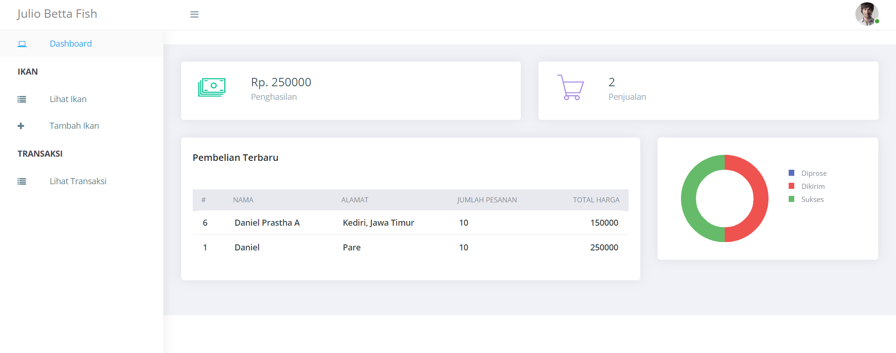

# julio-betta-fish-backend

julio betta fish backend using laravel

# Setting Up

## Clone Repository

`git clone https://github.com/dprastha/julio-betta-fish-backend.git`

## Fetch dan pull biar up-to-date

`git fetch` \
`git pull origin main`

# Import Database

## Import database to phpmyadmin on folder importDB/julio-betta-fish.sql

Pastikan nama database sama dengan nama file .sql

## NPM install

`npm i`

## composer install

`composer i`

# Running Development

`php artisan serve`

# API documentation

https://documenter.getpostman.com/view/13334944/TzRNGWKa
